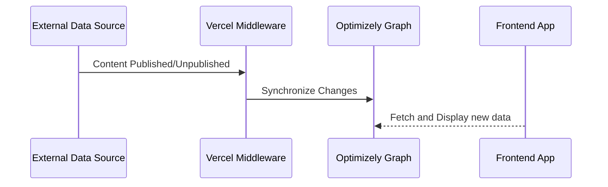

## Quick Deploy
[](https://vercel.com/new/clone?repository-url=https%3A%2F%2Fgithub.com%2Fkunalshetye%2Fog-wordpress&env=OG_APP_KEY,OG_APP_SECRET,NEXT_PUBLIC_OG_SINGLE_KEY,WP_WEBHOOK_SECRET)

This is a Next.js app that demonstrates how you can do the following:

- Setup Schema for External Content Sources in Optimizely Graph
- Ingest Data from External Content Sources into Optimizely Graph
- Setup WordPress to automatically push posts into Optimizely Graph


## Environment Variables
The following variables have to be configured in a _.env file when running locally_ or under vercel when you deploy this application

| Variable Name             | Purpose                                                                                            |
|---------------------------|----------------------------------------------------------------------------------------------------|
| OG_APP_KEY                | The AppKey from Optimizely Graph                                                                   |
| OG_APP_SECRET             | The Secret from Optimizely Graph                                                                   |
| NEXT_PUBLIC_OG_SINGLE_KEY | The single key from Optimizely Graph                                                               |
| WP_WEBHOOK_SECRET         | The secret passed to the /api/wordpress?secret={value} to authorize sync to Optimizely Graph calls |


## Setup Schema for External Content Sources in Optimizely Graph
_Note: make sure you have executed the **yarn** command in the root directory to install the relevant packages_

run `yarn schema:push` command to do the following:
- Create an External Source with id `wp` and with a content schema called `WordpressPosts`
- Ingest Hello World post for the newly defined schema
- Execute a graphql query to retrieve the newly ingested post

You can also verify this in your browser by going to https://cg.optimizely.com/app/graphiql?auth={NEXT_PUBLIC_OG_SINGLE_KEY} and executing the following graphql query:

```graphql
query PostsFromWordpress {
  WordpressPosts {
    items {
      _score
      Id
      Title
      Content
      Thumbnail
    }
  }
}
```

## Ingest Data from External Content Sources into Optimizely Graph

This is done with the help of [Route Handlers](https://nextjs.org/docs/app/building-your-application/routing/route-handlers) in Next.js

The wordpress route handler can be found under: `src/app/api/wordpress/route.js`

The data flow looks like this:



When there's any change in the external data source, the changes are pushed to the Next.js middleware allowing it to perform ELT operations on the wordpress data and ingest it into Optimizely Graph

## Setup WordPress to automatically push posts into Optimizely Graph

This makes use of the [WP Webhooks](https://wordpress.org/plugins/wp-webhooks/) plugin to notify the Next.js middleware about the changes that occur in WordPress.

By default, the Next.js middleware is only handling the `Post` type in WordPress so after you install the WordPress plugin you can enable the following webhooks:
- Post Created
- Post Updated
- Post Trashed

When registering the webhook url in WordPress make sure you include the value of `WP_WEBHOOK_SECRET`
Example Webhook Url to use: `https://og-wordpress.vercel.app/api/wordpress?secret=super-strong-secret`

## Getting Started

First, run the development server:

```bash
npm run dev
# or
yarn dev
# or
pnpm dev
# or
bun dev
```

Open [http://localhost:3000](http://localhost:3000) with your browser to see the result.

You can start editing the page by modifying `app/page.js`. The page auto-updates as you edit the file.

This project uses [`next/font`](https://nextjs.org/docs/basic-features/font-optimization) to automatically optimize and load Inter, a custom Google Font.

#
